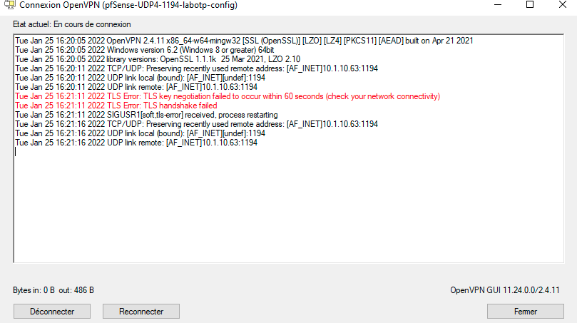
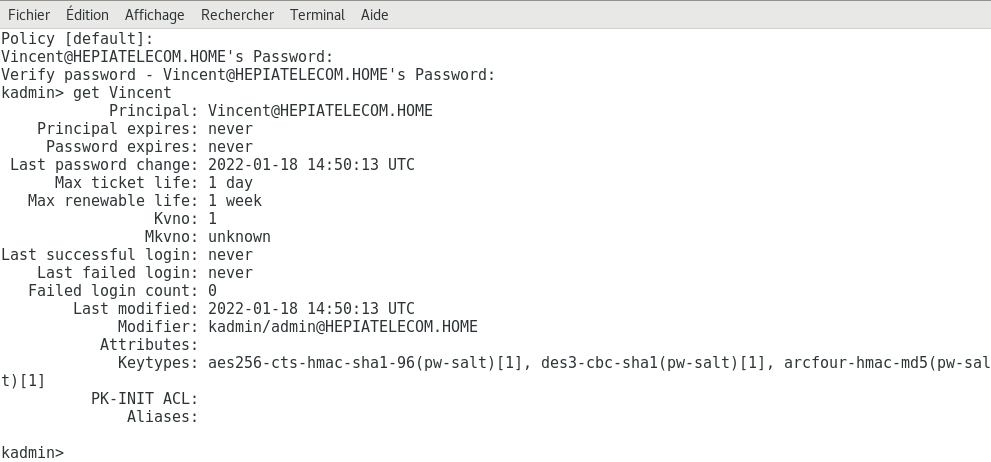

\title{Compte rendu des travaux pratiques}
\author{Lambert Luc, Andrey Vincent}
\date{\today}
  
\maketitle
\newpage

\tableofcontents
\newpage

## TP1 : ElGamal

### Andrey Vincent

```python
import random
import hashlib

def modulo(a,b):
    return a - (b*(a//b))

def pgcd(a, b):
    """pgcd(a,b): calcul du 'Plus Grand Commun Diviseur' entre les 2 nombres entiers a et b"""
    if b == 0:
        return a
    else:
        result = modulo(a,b)
        return pgcd(b, result)

def euclide_etendu(q,r):
    tmp_q = q
    tmp_r = r
    Q1 = 1
    Q2 = 0
    R1 = 0
    R2 = 1
    modulo = 0
    div_ent = 0
    T1 = 0
    T2 = 0

    if pgcd(q, r) != 1:
        raise ValueError(str(q) + " et " + str(r) + " ne sont pas premiers entre eux, pas possible de faire euclide étendu\n")
    else:
        while True:
            modulo = modulo(tmp_q,tmp_r)
            div_ent = tmp_q // tmp_r
            T1 = Q1 - div_ent * R1
            T2 = Q2 - div_ent * R2
            if tmp_q % tmp_r == 0:
                break
            Q1 = R1
            Q2 = R2
            R1 = T1
            R2 = T2
            tmp_q = tmp_r
            tmp_r = modulo
        res = q * R1 + r * R2
        return res

def expo_mod(g,a,p):
    nombre_bin = []

    i = 0
    res = 0
    m = 1

    """On convertit a en binaire"""
    while a > 0:
        nombre_bin.append(modulo(a,2))
        a = int(a / 2)
        i = i + 1

    """l'expo modulaire"""
    for z in range(i):
        res = modulo((g**(2**z)),p)
        if nombre_bin[z] == 1:
            m = modulo((m * res),p)
    return m

def generator(p):
    List_number = []
    for i in range(1,p):
        List_number.append(i)
    Test_list = [1]
    for g in range(2,p):
        for j in range(1,p-1):
            Test_list.append(modulo(g**j,p))
        Test_list.sort()
        if Test_list == List_number:
            return g
        else:
            Test_list = [1]

def inverse_mod(k,p):
    nb_mult = 0
    tmp = k
    while True:
        nb_mult = nb_mult + 1
        if modulo(tmp,p) == 1:
            break
        tmp = tmp + k
    return nb_mult

def sign(file):
    f = open(file,'r')
    txt = f.read()
    f.close()
    md5 = hashlib.md5()
    md5.update(txt.encode('utf-8'))
    h = md5.digest()
    m = int.from_bytes(h, "big")
    m %= 10 ** 6

    p = int(input("Entrez un nombre entier : "))
    a = random.randint(1,p)
    g = generator(p)

    A = expo_mod(g,a,p)
    pub_key = (p,g,A)

    k = random.randint(1, p - 1)
    while pgcd(k, p - 1) != 1:
        k = random.randint(1, p - 1)

    Y = expo_mod(g,k,p)
    S = modulo(inverse_mod(m-a*Y,p),p-1)

    return Y,S,pub_key,m

def Verif(m,Y,S,pub_key):
    p=pub_key[0]
    g=pub_key[1]
    A=pub_key[2]
    if A**Y*Y**S == expo_mod(g,m,p):
        print("Votre fichier est vérifié")
    else:
        print("Il y a un problème dans la vérification de votre fichier")

file = input("Entrez le nom de votre fichier: ")
```

### Lambert Luc

```python
import math
import hashlib
import random

def Calculate_A(g,a,p):
    return Expo_mod(g,a,p)

def Find_g(p):
    tmp = [1]
    cmp_res = [i for i in range(1,p)]
    for g in range(2, p):
        for i in range(1,p-1):
            tmp.append(Modulo(g**i,p))
        tmp.sort()
        if tmp == cmp_res:
            return g
        else :
            tmp = [1]

def Signature_ElGamal(g, a, p, k, m):
    # Y=gkmod(p)
    Y = Expo_mod(g, k, p)
    # S=(m-aY)k-1mod(p−1)
    S = (m-a*Y)*Inv_mod(k, p-1)
    S = Modulo(S,p-1)
    return Y, S

def Verif(m, Y, S, pub_key):
    #est vrai si A^Y*Y^S=g^m mod(p)
    Modulo(pub_key[2]**Y*Y**S, pub_key[0])
    n = Expo_mod(pub_key[1], m, pub_key[0])
    return Modulo(pub_key[2]**Y*Y**S, pub_key[0]) == n

def Expo_mod(g,a,p):
    #convertir l'exponent a en binaire
    b = format(a,"b")
    #reverse b
    b = b[::-1]
    res = 1
    for i in range(len(b)):
        if b[i] == "1":
            res *= Modulo(g**2**i, p)
    return Modulo(res, p)

#Crible ératosthène Recursif
def Crible(p):
    tab = [i for i in range(1,p+1)]

    def inner(tab, n):
        for elem in tab:
            if (elem % n == 0) and (elem != n):
                tab.remove(elem)
        n += 1
        if n >= p:
            return tab
        return inner(tab, n)
    
    return inner(tab, 2)

def Modulo(a, b):
    q = a // b
    return a - q*b

def Inv_mod(n, mod):
    a,u,b,v = Euclide_etendue(n, mod)
    if u < 0 :
        return b + u
    return u

def Euclide_etendue(q, r):
    if pgcd(q, r) != 1:
        raise ValueError("les paramètres ne sont pas premiers entre eux, il est impossible de réaliser l'algorithme d' euclide étendu.")
    #init tab
    tab = [q, r, Modulo(q,r), (1,0), q//r, (0,1), (1,0)]

    while Modulo(tab[0],tab[1]) != 0 :
        tab[0] = tab[1]
        tab[1] = tab[2]
        tab[2] = Modulo(tab[0],tab[1])
        tab[3] = tab[5]
        tab[4] = tab[0] // tab[1]
        tab[5] = tab[6]
        tab[6] = (tab[3][0] - tab[4]*tab[5][0], tab[3][1] - tab[4]*tab[5][1])
    return q,  tab[5][0], r, tab[5][1]
        
def pgcd(a, b):
    if b == 0:
        return a
    else:
        result = a % b
        return pgcd(b, result)

def Sign(file):
    # opening and hashing file
    f = open(file, 'r')
    content = f.read()
    f.close()
    md5 = hashlib.md5()
    md5.update(content.encode('utf-8'))
    h = md5.digest()

    # making int value from file 
    m = int.from_bytes(h, "big")
    #m is to big take too much time for Expo Mod
    m %= 10**6
    #sign file 
    #choose p
    tab_of_prim = Crible(500)
    p = tab_of_prim[-1]
    #choose a, g, k
    a = random.randint(1, p)
    g = Find_g(p)
    # k should be prime with p-1 
    while True : 
        k = random.randint(1, p-1)
        if pgcd(k, (p-1)) == 1:
            break

    pub_key = (p, g, Calculate_A(g,a,p))
    Y, S = Signature_ElGamal(g, a, p, k, m)
    return Y, S, m, pub_key

Y, S, m, pub_key = Sign('file.txt')
print("file.txt have been signed")

if Verif(m, Y, S, pub_key):
        print("file.txt have been verified")   
```

\newpage

## TP2 : DOS

### 1 Préparation du serveur

La machine serveur lance le serveur avec la commande  

```bash
sudo python3 -m http.server<port>
```

ip server : 192.168.230.131  
ip attaquant : 192.168.230.46  

Pour vérifier que l'attaquant arrive à acceder au serveur il doit lancer un navigateur et rentrer dans la barre :  

```bash
<ip serveur>:<port> 
```

Si cela fonctionne, il devrait voir un explorateur de fichier  

### 2 Programmation du script d'attaque

**Commencer par essayer d’envoyer une requête toute simple sur la machine Serveur. Quelle est la librairie requise ?**  

La librairie requise pour pour envoyer une requête GET sur la machine serveur est la librairie "requests".  

### 3 Envoyer un grand nombre de de requêtes

**Dans le programme, commencer par utiliser une boucle pour essayer de faire tomber le serveur. Que remarquez-vous ?**  

En essayant avec une grande boucle, nous remarquons que les requêtes se font l'une après l'autre, attendant que la précédente soit fini. Ce n'est donc pas du tout efficace  

### 4 Lancement de l’attaque

### 5 Protections contre le déni de service

**Quelles sont les protections utilisées à l’heure actuelle pour contrer un déni de service ?**  

Limiter le nombre de requête succesive d'une même ip.  

**Lancer la commande qui ignore quandplus de 4 paquets par seconde issus de la même adresse IP sont reçus.Il faut ici utiliser les options du module recent de iptables.Relancer l’attaque. Que remarquez-vous ?**  

Cela previent le DOS.  

\newpage

## TP3 : DNS

**A quoi sert un serveur DNS ?**  

Un serveur DNS (Domain Name Server) sert à traduire le nom de domaine entré par l'utilisateur vers l'adresse ip corespondante.  

Serveur DNS IP = 192.168.192.129  
Client IP = 192.168.192.133  
Attaquant IP = 192.168.192.132  

### 1. Configuration DNS

* Installer bind9 sur la vm DNS_Serv  
```
sudo apt install bind9
```

* modifier le fichier **/etc/cache/bind/named.conf.option** :  
    - Commenter la ligne *dnssec-validation auto;*  
    - Rajouter la ligne *dnssec-enable no;*  

* Restart le serveur DNS :  

```
sudo systemctl restart bind9
```

### 2. Configuration Client

* Changer dans les paramètres réseau l'adresse du serveur dns par celle de la vm du serveur DNS.  

* restart le network manager :  
```
sudo /etc/init.d/networking restart
```

### 3. Configuration machine host VM

choisir l'interface VMnet8  

choisir un filtre dans le wireshark  
```
ip.addr==192.168.192.129  
```

Après avoir ping hepia.ch on obtient sur le wireshark :  
  

**Effectuer une nouvelle fois ce ping, que se passe-t-il ? Pourquoi ?**  

Il n'effectue pas la requête DNS car le client connait déjà l'addresse ip correspondante au serveur hepia.ch.  

### 4. Configurer une zone sur le serveur DNS

modifier le fichier **/etc/bind/named.conf.local**. Ajouter les lignes suivantes :  
```
zone "labhepia.ch" {
    type master;
    file "/etc/bind/db.labhepia.ch.zone";
};
```

copier le fichier db.empty :  
```
sudo cp db.empty db.labhepia.ch.zone
```

modifier le fichier **db.labhepia.ch.zone**:  

```
...

@ IN MS ns.labhepia.ch
@ IN MX 10 mail.labhepia.ch

www IN A ? ; ?
www IN A ? ; Address of mail.labhepia.ch
client IN A ? ; ?
attack IN A ? ; ?
* IN A ? ; ?
```

redémarrer le service bind :  
```
sudo systemctl restart bind9
```

modifier le fichier **/etc/hosts** sur la machine DNS Client. Rajoutez à la 3<sup>ème</sup> ligne :  

```
1.2.3.4   www.mabanque.ch
```

On essaie maintenant de ping *www.mabanque.ch* et on obtient :  
  

### 5. Configuration machine Attanquante

modifier le fichier **/etc/ettercap/etter.dns**. Dans la partie *"microsoft sucks :)"* :  

```
microsoft.com A 192.168.192.132
*.microsoft.com A 192.168.192.132
www.microsoft.com PTR 192.168.192.132
```

Start ettercap avec une interface graphique :  
```
ettercap -G
```

Dans les onglets :  
* sniff->Unified Sniffing->eth0  
* hosts->scan for host  
* hosts->hosts list->192.168.192.129 et 192.168.192.133  
* MITM->ARP Poisonning->Sniff remote Connection->Valider  
* Plugins->Manage the plugins->dns_spoof  

Vider le cache sur le client :  
```
sudo systemd-resolve --flush-caches
```

**Vérifier et montrer que l'attaque fonctionne. Désactiver le spoofing et refaire une requête, que se passe-t-il ? Pourquoi ?**  

On ne peut toujours pas accéder au site car l'adresse de l'attaquant et toujours dans le cache.  

### 6. Poisonning DNS

supprimer le cache du serveur DNS.  

```
sudo rmdc flush
```

Poisonning DNS:  
```
sudo netwox 105 -h www.hepia.ch -H 192.168.192.132 -a ns.hepia.ch -A 192.168.192.132 --spoofip "raw" --ttl 86400
```

vider le cache sur le client :  
```
sudo systemd-resolve --flush-caches
```
**Que se passe-t-il ?**  

Vider le cache du client est inutile car c'est le cache du DNS qui a été empoisonné  

\newpage

## TP4 : Firewall et VPN

**A quoi sert un Firewall ?**     
Un Firewall sert a filtrer les paquets sortant ou entrant dans un sous-réseau.  

**Mise en place :**    

addresse ip pfSense :  
WAN -> 10.1.10.66  
LAN -> 192.168.2.1/24  

**Quelle est la différence entre WAN et LAN ?**  

WAN signifie Wireless Area Network (réseau entre plusieurs infrastructures peu éloigné) et LAN signifie Local Area Network (réseau à l'intérieur d'une infrastructure).  

### 1. Configuration de la VM Ubuntu

Dans les réglages réseaux de Ubuntu modifier la méthode IPv4->manuel  

* adresse : 192.168.2.3  
* masque: 255.255.255.0  
* passerelle : 192.168.2.1  
* DNS : 192.168.2.1  

Désactiver réactiver l'ethernet pour prise en compte du changement  

### 2. Configuration du pfSense 

Pour configurer pfSense depuis la vm-Ubuntu ouvrir un navigateur et rentrer l'addresse ip de la vm pfSense : 192.168.2.1  

passer tout les étapes de configuration. Dans l'onglet System->Package Manager->Available Packages, installer Open-VM-Tools.  

Dans l'onglet Interface->WAN->reserved network décochez block private networks and loopback addresses et save.  

**Que fait cette option si elle est cochée ? Pourquoi, dans notre cas elle ne doit pas l'être ?**  

Elle bloque le trafic provenant d'addresse privée. C'est un problème pour nous car nous travaillons dans un réseau privée.  

### 3. Mise en place de règles de sécurité

Dans Firewall->Aliases->Edit:  
Name : http_s  
Port : 80 http  
Port : 443 https  

Dans Firewall->Rules->Ajouter:  
Action->Block  
Interface->LAN  
Protocole->TCP/UDP  
Source->Single host or alias 192.168.2.3  
Destination->any  
Destination Port Range-> (other) http_s (other) http_s  

  

**Quelle est la différence entre les trois types (pass - block - reject) de règles ?**  

* pass laisse passer un certain type de données  
* block jette les données qui ne passe pas  
* reject renvoie les données a celui qui envoie.  


Création des règles pour site hepia et hesge :   

Dans Firewall->Aliases->Edit:   
Name : hepia_hesge  
Type : host  
URL : http://www.hepia.ch  
URL : http://www.hesge.ch  
save  

Dans Firewall->Rules->Ajouter:  
Action->Block  
Interface->LAN  
Protocole->TCP/UDP  
Source->Single host or alias 192.168.2.3  
Destination->single host or alias hepia_hesge  
Destination Port Range-> (other) http_s (other) http_s  
save  

Création des règles pour ping wan depuis machine hôte :    

Dans Firewall->Rules->Ajouter:  
Action->Block  
Interface->LAN  
Protocole->ICMP  
Source->Single host or alias 10.1.11.35  
Destination->WAN net  
save  

### 4. Création de configuration d'un VPN

Création d'un utilisateur VPN :  
Username : labotp  
Password : labo  
Cochez Certificate.  

**Pourquoi doit-on créer un certificat pour l’utilisateur ?**  

Pour fournir le certificat au protocole sécurisé utilisé derrière.  

   

### 5. Protéger l’accès au pfSense  

**Comment feriez-vous pour autoriser toutes les machines dans le sous-réseau de la VM Ubuntu?**
On ajouterait une règle qui autorisent uniquement les machines dans le sous-réseau de la VM Ubuntu.

\newpage

## TP5 : Kerberos
### 1. Préparation des machines 
**a) Les interfaces réseaux**  

Dans les paramètres réseau des machine virtuelle suivre les consignes du TP:  
- enp0s9 Internal  
- enp0s3 NAT  
- Eteindre enp0s8  

Voici les addresses ip des machines :  
- IP kerberos 192.168.0.1  
- Serveur 192.168.0.2  
- Client 192.168.0.3  
- NAT 10.0.2.15  

Que vous retourne :    
- hostname ? nom de la machine  
- hostname -d ? le domaine, hepiatelecom.home pour kerberos et client.  
- hostname -f ? le fqdn, concatenation de hostname et hostname -d.  

**b) Les horloges**  

Pour synchroniser les horloges :  
```
su
ntpdate pool.ntp.org
```

**c) DNS**  

Désactiver l'interface enp0s3.  
Pour vérifier la résolution de nom sur le client :  
```
nslookup client.hepiatelecom.home
```
Ne fonctionne pas sur le serveur car le domaine n'a pas été configuré.  

### 2. Installation des paquets Kerberos et configuration

Activer l'interface enp0s3.  
Installer heimdal-servers  
```
su
apt-get update
apt-get install heimdal-servers
```

Configurer krb5-config  
```
HEPIATELECOM.HOM
kerberos.hepiatelecom.home
kerberos.hepiatelecom.home
```

Installer heimdal-clients  
```
su
apt-get update
apt-get install heimdal-clients
```

Puis configurer krb5.  

Installer heimdal-kdc  
```
su
apt-get update
apt-get install heimdal-kdc
```

Le faire sur chaque machine pour himdal-clients et krb5-config.  

### 3. Initialisation de la base de données, création du premier principal

Désactiver enp0s3.  

Créer la clef de stockage pour chiffrer la base de données :  
```
kstash --random-key
kadmin -l
init HEPIATELECOM.HOME
add vincent
get vincent
```

  

Redémarrer le serveur de clés :  
```
systemctl restart heimdal-kdc
```

### 4. Récupération d'un ticket sur une autre machine

Créer un utilisateur sur le client.  
```
adduser vincent
su vincent
```

Pour récupérer un ticket:  
```
kinit
```
Le mot de passe est demandé.  
```
klist
```
  

### 5. Création du principal pour le service ssh et installation de la clé de service

Modifier le fichier de kerberos **/etc/heimdal-kdc/kadmin.acl** rajoutez la ligne :   
```
vincent@HEPIATELECOM.HOME all,get-keys
```
redémarrez ensuite le serveur de clés:  
```
systemctl restart heimdal-kdc
```

On va maintenant créer un principal:  
```
kadmin -p vincent
add --random-key --use defaults host/server.hepiatelecom.home
ext_keytab host/server.hepiatelecom.home
```

Au final lister les clées avec :  
```
ktutil list
```

  

### 6. Configuration du serveur et client ssh

Activez enp0s3  

depuis le serveur installer un serveur ssh :  

```
apt get install openssh-server
```

modifier le fichier config.  

```
/etc/ssh/sshd_config
```

mettre les valeurs suivantes a yes :  
- KerberosAuthentication  
- KerberosTicketCleanup  
- GSSAPIAuthentication  
- GSSAPICleanupCredentials  

KerberosTicketCleanup sert a effacer les tickets.  

Désactiver l'interface enp0s3  

Créer un utilisateur sur le serveur ssh :  
```
adduser vincent 
ssh 192.169.0.2
klist
```

On s'appercoit qu il n y a pas de ticket.  
