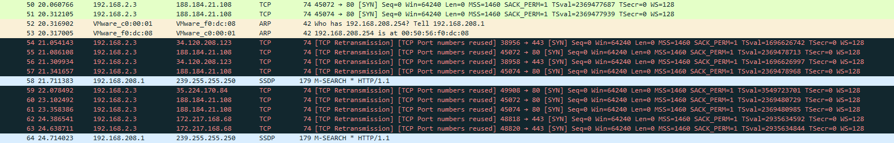

# Labo - Firewall et VPN
## A quoi sert un Firewall ?  
Un Firewall sert a filtrer les paquets sortant ou entrant dans un sous-réseau.

## Mise en place :  

addresse ip pfSense :
WAN -> 10.1.10.66
LAN -> 192.168.2.1/24

### Quelle est la différence entre WAN et LAN ?

WAN signifie Wireless Area Network (réseau entre plusieurs infrastructures peu éloigné) et LAN signifie Local Area Network (réseau à l'intérieur d'une infrastructure).

## 1. Configuration de la VM Ubuntu

Dans les réglages réseaux de Ubuntu modifier la méthode IPv4->manuel

* adresse : 192.168.2.3 
* masque: 255.255.255.0
* passerelle : 192.168.2.1
* DNS : 192.168.2.1

Désactiver réactiver l'ethernet pour prise en compte du changement

## 2. Configuration du pfSense 

Pour configurer pfSense depuis la vm-Ubuntu ouvrir un navigateur et rentrer l'addresse ip de la vm pfSense : 192.168.1.2

passer tout les étapes de configuration. Dans l'onglet System->Package Manager->Available Packages, installer Open-VM-Tools.

Dans l'onglet Interface->WAN->reserved network décochez block private networks and loopback addresses et save.

### Que fait cette option si elle est cochée ? Pourquoi, dans notre cas elle ne doit pas l'être ?

Elle bloque le trafic provenant d'addresse privée. C'est un problème pour nous car nous travaillons dans un réseau privée.

## 3. Mise en place de règles de sécurité.

Dans Firewall->Aliases->Edit:  
Name : http_s  
Port : 80 http  
Port : 443 https  

Dans Firewall->Rules->Ajouter:  
Action->Block
Interface->LAN
Protocole->TCP/UDP
Source->Single host or alias 192.168.2.3
Destination->any
Destination Port Range-> (other) http_s (other) http_s

### Quelle est la différence entre les trois types (pass - block - reject) de règles ?

* pass laisse passer un certain type de données
* block jette les données qui ne passe pas 
* reject renvoie les données a celui qui envoie.

Création des règles pour site hepia et hesge :  

Dans Firewall->Aliases->Edit:  
Name : hepia_hesge
Type : host
URL : http://www.hepia.ch
URL : http://www.hesge.ch
save  

Dans Firewall->Rules->Ajouter:  
Action->Block
Interface->LAN
Protocole->TCP/UDP
Source->Single host or alias 192.168.2.3
Destination->single host or alias hepia_hesge
Destination Port Range-> (other) http_s (other) http_s
save

Création des règles pour ping wan depuis machine hôte :  

Dans Firewall->Rules->Ajouter:  
Action->Block
Interface->LAN
Protocole->ICMP
Source->Single host or alias 10.1.11.35
Destination->WAN net
save  

## 4. Création de configuration d'un VPN.

