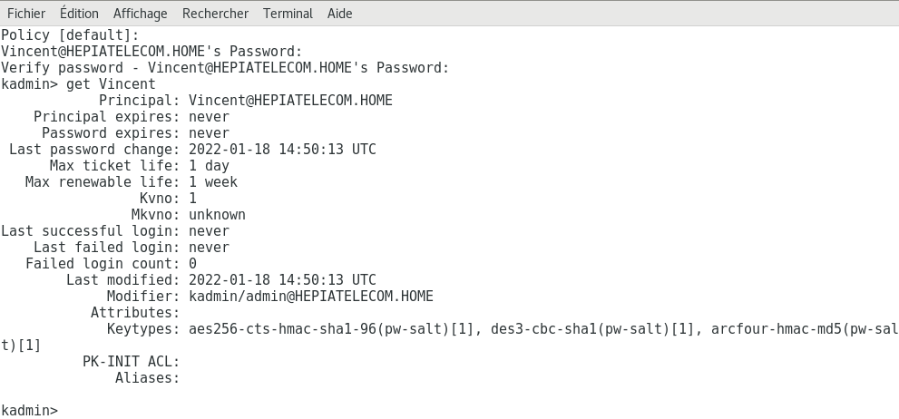
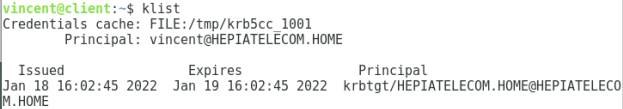
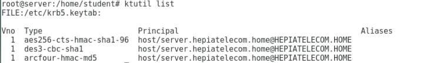

# TP 5 - Kerberos
## 1. Préparation des machines 
### a) Les interfaces réseaux

Dans les paramètres réseau des machine virtuelle suivre les consignes du TP: 
- enp0s9 Internal
- enp0s3 NAT
- Eteindre enp0s8

Voici les addresses ip des machines :
- IP kerberos 192.168.0.1
- Serveur 192.168.0.2
- Client 192.168.0.3
- NAT 10.0.2.15

Que vous retourne :  
- hostname ? nom de la machine
- hostname -d ? le domaine, hepiatelecom.home pour kerberos et client.
- hostname -f ? le fqdn, concatenation de hostname et hostname -d.

### b) Les horloges

Pour synchroniser les horloges :
```
su
ntpdate pool.ntp.org
```

### c) DNS

Désactiver l'interface enp0s3.
Pour vérifier la résolution de nom sur le client :
```
nslookup client.hepiatelecom.home
```
Ne fonctionne pas sur le serveur car le domaine n'a pas été configuré.

## 2. Installation des paquets Kerberos et configuration

Activer l'interface enp0s3.
Installer heimdal-servers
```
su
apt-get update
apt-get install heimdal-servers
```

Configurer krb5-config 
```
HEPIATELECOM.HOM
kerberos.hepiatelecom.home
kerberos.hepiatelecom.home
```

Installer heimdal-clients
```
su
apt-get update
apt-get install heimdal-clients
```

Puis configurer krb5.

Installer heimdal-kdc
```
su
apt-get update
apt-get install heimdal-kdc
```

Le faire sur chaque machine pour himdal-clients et krb5-config.

## 3. Initialisation de la base de données, création du premier principal

Désactiver enp0s3.

Créer la clef de stockage pour chiffrer la base de données :
```
kstash --random-key
kadmin -l
init HEPIATELECOM.HOME
add vincent
get vincent
```



Redémarrer le serveur de clés :
```
systemctl restart heimdal-kdc
```

## 4. Récupération d'un ticker sur une autre machine

Créer un utilisateur sur le client.
```
adduser vincent
su vincent
```

Pour récupérer un ticket:
```
kinit
```
Le mot de passe est demandé.
```
klist
```


## 5. Création du principal pour le service ssh et installation de la clé de service

Modifier le fichier de kerberos **/etc/heimdal-kdc/kadmin.acl** rajoutez la ligne : 
```
vincent@HEPIATELECOM.HOME all,get-keys
```
redémarrez ensuite le serveur de clés:
```
systemctl restart heimdal-kdc
```

On va maintenant créer un principal:
```
kadmin -p vincent
add --random-key --use defaults host/server.hepiatelecom.home
ext_keytab host/server.hepiatelecom.home
```

Au final lister les clées avec :
```
ktutil list
```



## 6. Configuration du serbeur et client ssh

Activez enp0s3

depuis le serveur installer un serveur ssh : 

```
apt get install openssh-server
```

modifier le fichier config .

```
/etc/ssh/sshd_config
```

mettre les valeurs suivantes a yes :
- KerberosAuthentication
- KerberosTicketCleanup
- GSSAPIAuthentication
- GSSAPICleanupCredentials

KerberosTicketCleanup sert a effacer les tickets. 

Désactiver l'interface enp0s3  

Créer un utilisateur sur le serveur ssh : 
```
adduser vincent 
ssh 192.169.0.2
klist
```

On s'appercoit qu il n y a pas de ticket.
