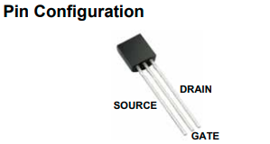
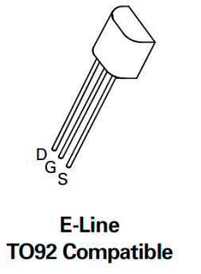
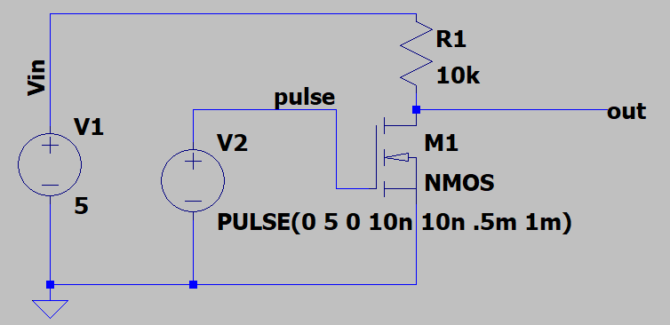
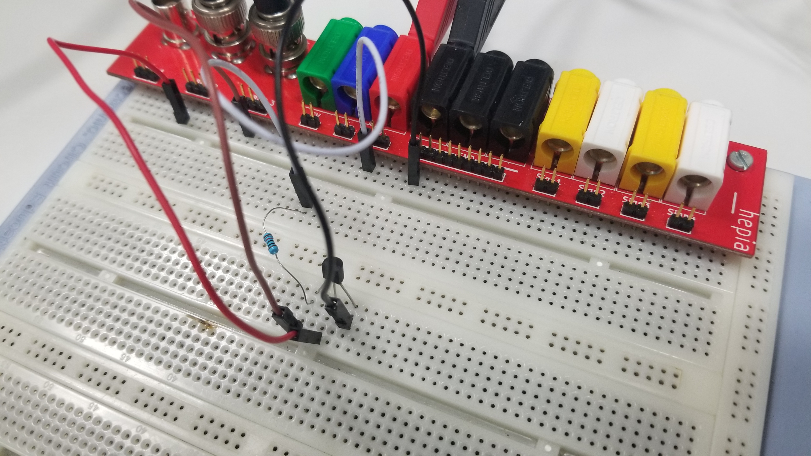
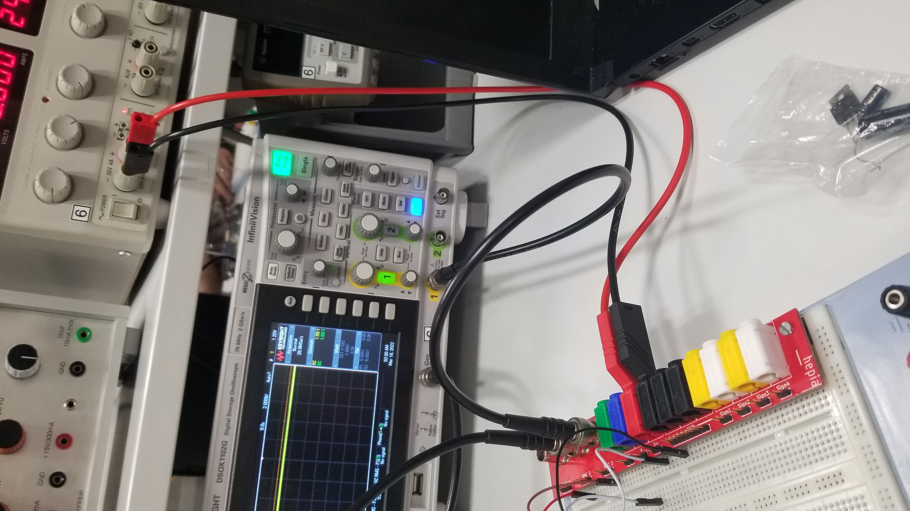
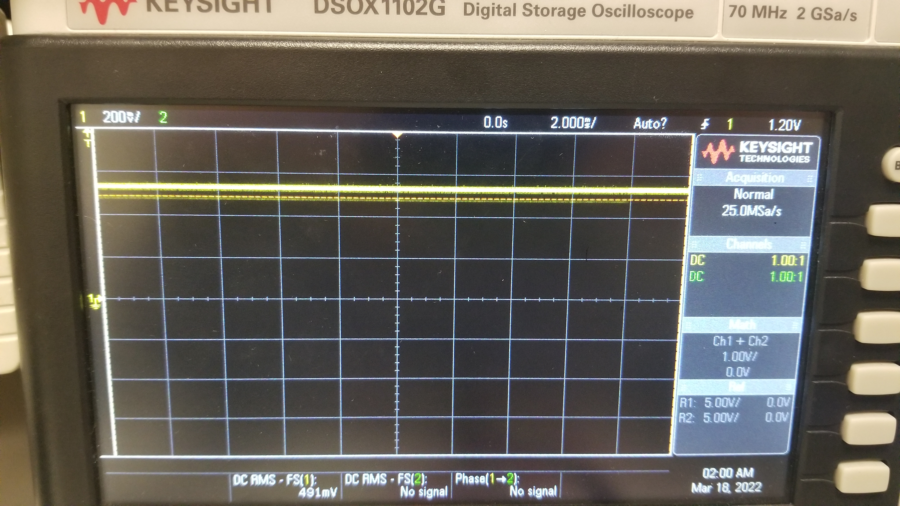
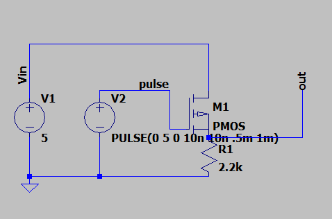
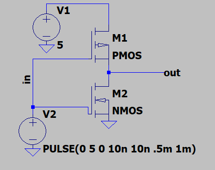

\title{TP3-Rapport : Montages à transistor MOS – Circuits logiques}
\author{Luc Lambert}
\date{\today}
\maketitle
\newpage

# Objectifs : 

Se familiariser avec les transistors MOS. Réaliser un inverseur logique avec des transistors.

# Matériels :

Alimentation DC de 5v.  

Horloge 10Hz.  

Résistance de 10kΩ.  

Transistor NMOS :    
TN0702  
-VGS  
    min = 0.5V  
    max = 1V  
-VSD  
    max=1V  

Transistor PMOS :    
BS250P  
-VGS  
    min=-1V  
    max=-3.5V  
-VSD  
    min=-45V    

\newpage

# Expériences :

## Inverseur NMOS :

Le schéma éléctrique suivant décrit le montage a réalisé pour obtenir et observer un inverseur logique à partir d'un transistor nmos. En effet Le signal pulse sera inverser sur la sortie out.  

En pratique, on peut réaliser le montage suivant. On génére un signal de clock (10Hz devrait être suffisant) grâce à l'oscilloscope.  

L'image suivante montre les résultats obtenu correspondant au  circuit réalisé au dessus. On s'apperçoit que ce n'est pas le résultat attendu. On devrait apercevoir un signal de clock. Si on obtient un signal de clock il faudra le comparé avec le signal en entré pour voir si il est bien inversé.  

\newpage

## Inverseur PMOS :

Le schéma éléctrique suivant décrit le montage a réalisé pour obtenir et observer un inverseur logique à partir d'un transistor pmos. En effet Le signal pulse sera inverser sur la sortie out.  

En réalisant une simulation de ce schéma on observe qu'il n'y a aucun signal qui s'affiche. On en conclut donc que soit le schéma est faux. Soit la réalisation de la simulation est manquée.

\newpage

## Inverseur CMOS :

Le schéma éléctrique suivant décrit le montage a réalisé pour obtenir et observer un inverseur cmos à partir des transistors pmos et nmos. En effet Le signal pulse sera inverser sur la sortie out.  

En réalisant une simulation de ce schéma on observe qu'il n'y a aucun signal qui s'affiche. On en conclut donc que soit le schéma est faux. Soit la réalisation de la simulation est manquée.

\newpage

# Conclusion :

On a essayé d'aborder tous les points de ce travail pratique. Les objectifs non pas été entièrements atteints. Mes connaissances sur les transistors MOS et PMOS on grandement augmenté mais la familiarisation et l'utilisation de ceci reste difficile. Par effet de bord la réalisation des inverseurs n'a pas pue être réussi.