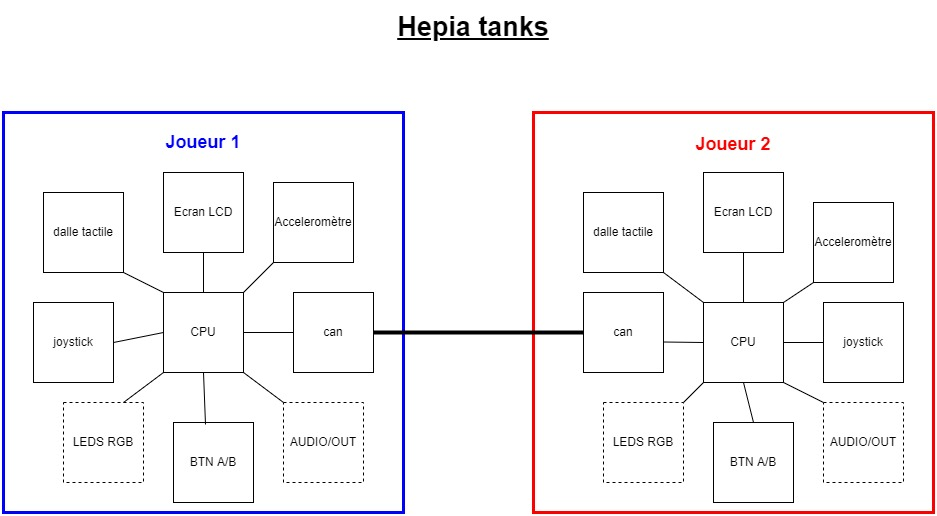

# Hepia Tanks

# Introduction

Hepia tanks est un jeu de tank adaptés a la carte mylab2. Ce jeu est inspiré de "Wii Play Tanks".  

Hepia tanks est un jeu 2 joueurs, vue de dessus, où chaque joueurs contrôle un tank dans le but de faire exploser celui de l'autre joueur.

# Specification du jeu

## Début du jeu

Le jeu démarre lorsque le joueur 1 appuie sur le bouton play de l'écran tactile.  
Une carte avec plusieurs obstacle est afficher sur l'écran.  
Les 2 tanks apparaissent à l'opposé un en haut de l'écran,et un en bas de l'écran.

## Maniabilité des tanks

Le joystick sert à déplacer son tank sur l'écran.  
L'accéléromètre sert à gérer l'orientation du canon.  
Le bouton A sert à tirer un obus dans la direction du canon.  
Le bouton B sert à déposer une mine sur le sol.

## Compétences des tanks

Le tank possède une réserve de 3 missiles qui se recharge à la vitesse 1 missiles toutes les 500 milisecondes.  
Le tank possède une mine qu'il peut déployer toutes les 5 secondes.  
Les obus rebondissent 1 fois sur les parois avant d'être détruis par la paroi suivante.

## fin du jeu 

Un tank explose quand il est touché par un obus ou roule sur une mine. L'écran de début de jeu est à nouveau afficher.

# Communication 

La communication entre les deux cartes sera réalisées par CAN.  
Le même code sera implémenté sur les deux carte le switch 0 permettra de différencié le joueur 1 du joueur 2.  
Chaque joueur envoie à l'autre, la position de son tank ainsi que l'orientation de son canon et la position de ses obus / mines.

# Amélioration possible 

Pilotage des leds rgb en fonctions de l'état de rechargement des obus et mines et fin de partie.

Led1 : 
* bleu 3 obus disponible.
* vert au moins 1 obus disponible, en cours de rechargement.
* jaune aucun obus disponible
* rouge tank explosé

Led 2 : 
* bleu 1 mine disponible
* jaune aucune mine disponible
* rouge tank explosé

Ajout de son sur la sortie audio.  
* détonation lors du tir d'obus
* bruit posage de mine
* bruit explosion du tank
* bruit déplacement du tank

# Schéma

